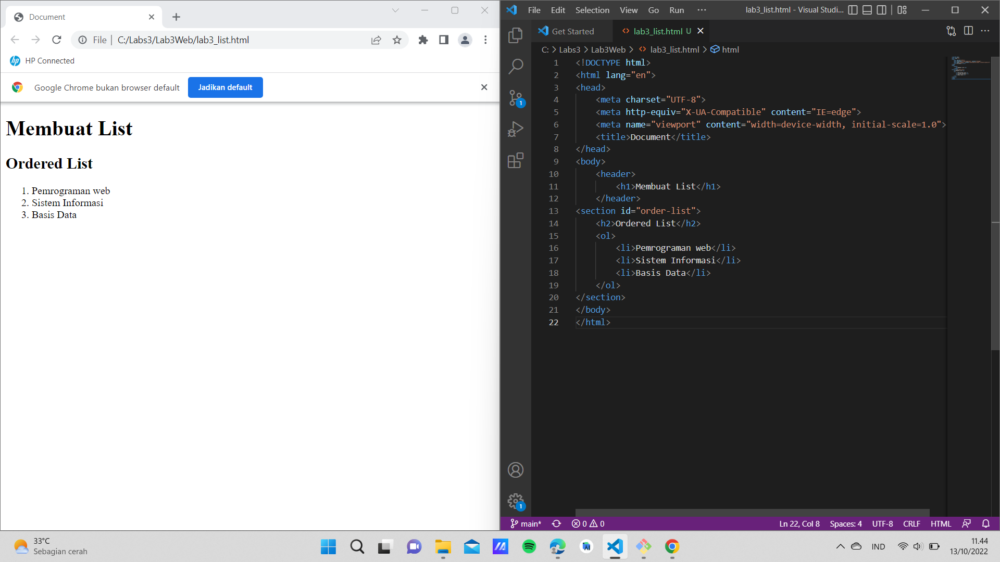
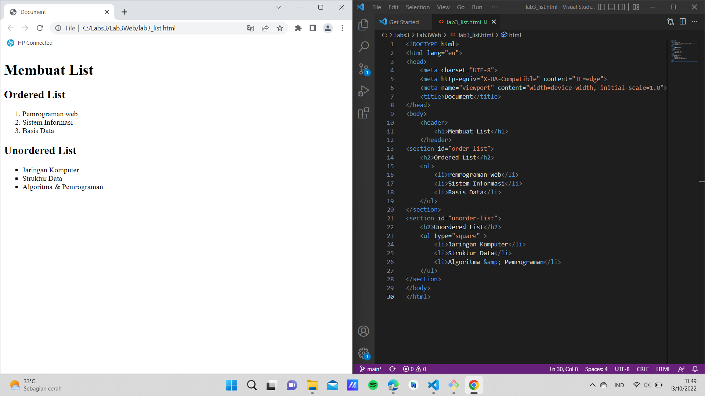
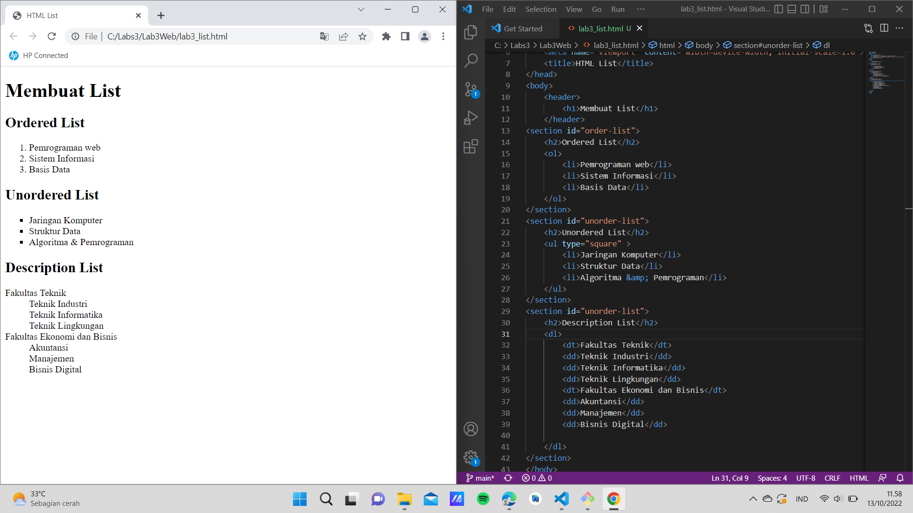
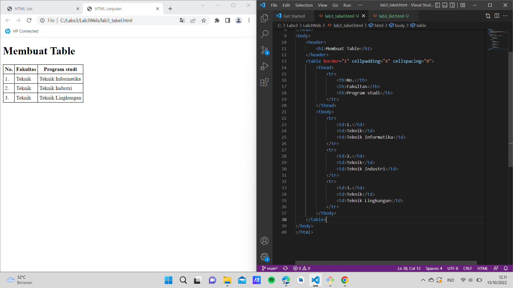
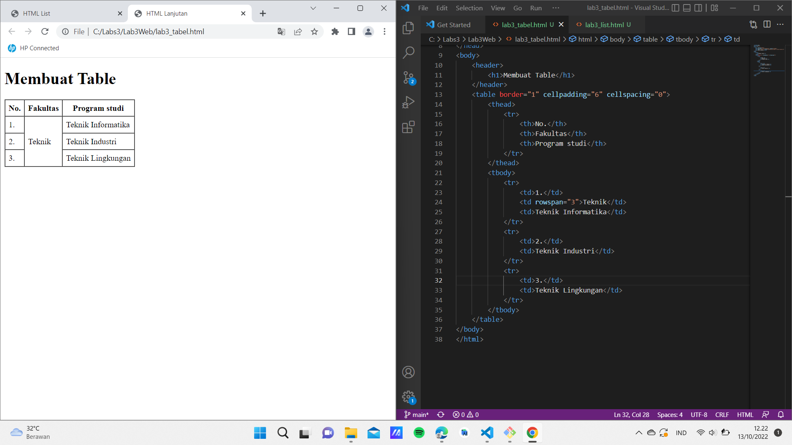
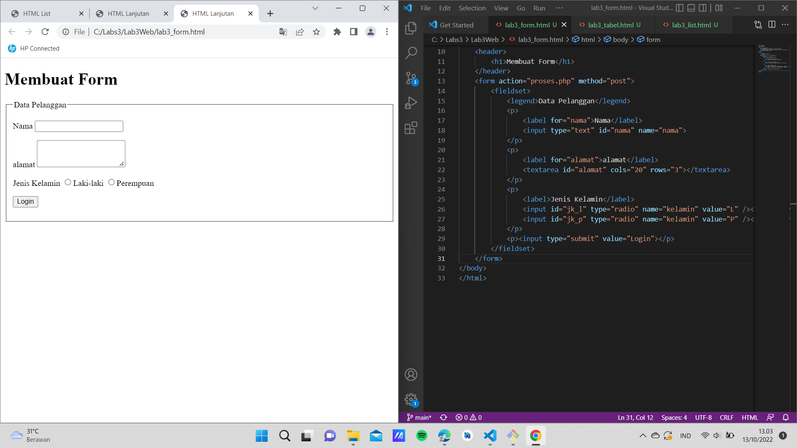
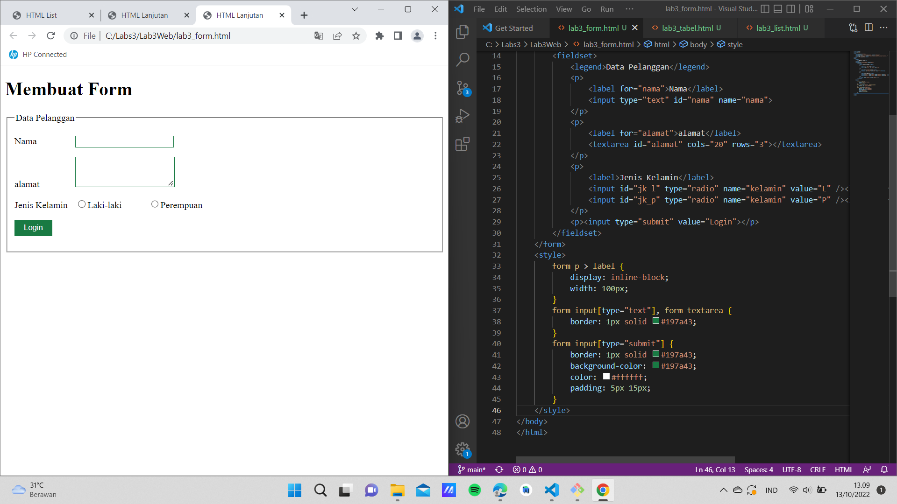

# Lab3Web
# Belajar Membuat List, Tabel dan Form

# Membuat Ordered List
ini adalah tampilannya 

# Membuat Unordered List
ini adalah tampilannya

# Membuat Description List
ini adalah tampilannya

# Membuat Tabel
ini adalah tampilannya

# Menggabungkan Sel Data
ini adalah tampilannya 

# Membuat Form 
ini adalah tampilannya

# menambahkan Style pada Form
ini adalah tampilannya
